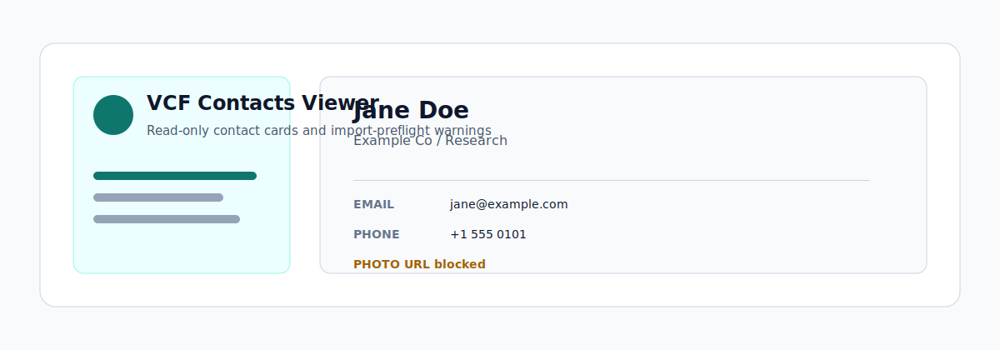
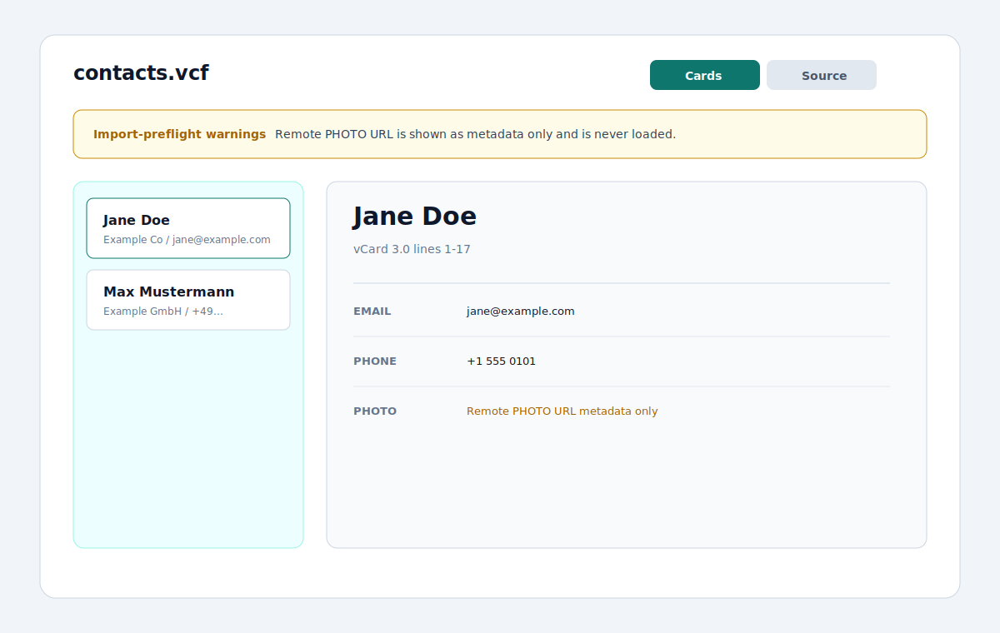

<p align="center">
  
</p>

<p align="center">
  <a href="https://github.com/viggomeesters/obsidian-vcf-contacts-viewer/releases/latest"></a>
  <a href="LICENSE"></a>
  
  
</p>

# VCF Contacts Viewer

VCF Contacts Viewer is a read-only Obsidian plugin for inspecting `.vcf` files as contact cards, raw source, and import-preflight warnings. It is built for safely reviewing vCards that arrive in a vault without turning Obsidian into a contact manager.



## Features

- Opens `.vcf` files in a dedicated view.
- Parses one or more `BEGIN:VCARD` / `END:VCARD` blocks.
- Supports common vCard 3.0 and 4.0 fields where practical.
- Shows a contact list with full name, organization, primary email, and primary phone.
- Shows detail fields for names, phones, emails, addresses, URLs, organization, title, birthday, UID, REV, categories, notes, PHOTO metadata, and raw fields.
- Provides raw source view with line numbers.
- Searches across names, organization, email, phone, normalized fields, and raw source.
- Reports import-preflight warnings for unsupported fields, malformed cards, folded-line issues, encoded fields, version mismatches, and PHOTO fields.
- Keeps PHOTO handling private: remote URLs are never loaded and embedded data is never rendered or imported.
- Stays read-only by design: it never writes back to `.vcf` files.

## Positioning

The existing community plugin [VCF Contacts](https://community.obsidian.md/plugins/vcf-contacts) is a richer contact manager with import, export, and markdown contact notes. VCF Contacts Viewer is deliberately narrower: it is a file viewer and import-preflight tool, not a CRM, sync tool, or contact note generator.

## Privacy and security

vCards often contain personal data. VCF Contacts Viewer keeps inspection local:

- no network APIs
- no clipboard APIs
- no `eval` or dynamic code execution
- no write-back to `.vcf`
- no contact note creation
- no contact export
- no click-to-call or mailto links
- no FaceTime, Contacts.app, or external app launch actions
- no remote PHOTO loading
- no avatar import

## Installation

### Community plugin directory

VCF Contacts Viewer is prepared for Community plugin directory submission. Once accepted, it can be installed from **Settings -> Community plugins -> Browse**.

### Manual installation

Until the community directory submission is accepted:

1. Download `main.js`, `manifest.json`, and `styles.css` from the latest release.
2. Create this folder in your vault: `.obsidian/plugins/vcf-contacts-viewer/`.
3. Put the downloaded files in that folder.
4. Reload the app.
5. Enable **VCF Contacts Viewer** in **Settings -> Community plugins**.

### BRAT installation

For beta testing, install the plugin with [BRAT](https://github.com/TfTHacker/obsidian42-brat) using this repository URL:

```text
https://github.com/viggomeesters/obsidian-vcf-contacts-viewer
```

## Usage

Open any `.vcf` file in your vault. The file opens with VCF Contacts Viewer.

Use the toolbar to:

- search contacts
- switch between cards and source views
- refresh the file after external changes

## Parser scope

The parser handles folded lines and common vCard 3.0/4.0 properties. It preserves raw fields so unsupported or unusual properties can still be inspected. Encoded fields such as quoted-printable and base64 are warned about instead of silently pretending the viewer fully decoded them.

## Development

```bash
npm install
npm run build
npx tsc --noEmit
npm test
```

For local development, copy or symlink this repository into `.obsidian/plugins/vcf-contacts-viewer/` inside a test vault.

## Release process

Community plugin files are installed from GitHub releases. For each release:

1. Update `manifest.json`, `package.json`, and `versions.json`.
2. Run `npm install`, `npm run build`, `npx tsc --noEmit`, and `npm test`.
3. Create a GitHub release whose tag exactly matches `manifest.json.version`.
4. Attach `main.js`, `manifest.json`, and `styles.css` as release assets.

The repository includes a GitHub Actions release workflow with artifact attestation support. If GitHub Actions is disabled for the owner account, manual releases are still usable for Obsidian, but the Community automated review may show a recommendation about missing artifact attestations.

## Community directory submission

The repository is prepared for Obsidian Community plugin submission. The remaining submission step must be completed by the repository owner in the Obsidian Community site because it requires signing in, linking GitHub, and confirming the developer policies/support commitment.

Submit this repository URL:

```text
https://github.com/viggomeesters/obsidian-vcf-contacts-viewer
```

Steps:

1. Sign in to [community.obsidian.md](https://community.obsidian.md).
2. Link the GitHub account that owns this repository.
3. Open **Plugins -> New plugin**.
4. Enter the repository URL above.
5. Confirm the developer policies and submit.
6. Address any automated review feedback.

The current release is ready for review:

- root `README.md`, `LICENSE`, and `manifest.json` exist
- `manifest.json.version` is `0.1.0`
- GitHub release `0.1.0` exists
- release assets include `main.js`, `manifest.json`, and `styles.css`
- `versions.json` maps supported Obsidian versions
- `manifest.json.id` is `vcf-contacts-viewer`, uses only lowercase letters and hyphens, does not contain `obsidian`, and does not end with `plugin`
- `manifest.json.name` is `VCF Contacts Viewer`, uses Basic Latin characters, and does not include `Obsidian`

Official references:

- [Submit your plugin](https://docs.obsidian.md/Plugins/Releasing/Submit%20your%20plugin)
- [Manifest reference](https://docs.obsidian.md/Reference/Manifest)
- [Obsidian releases repository](https://github.com/obsidianmd/obsidian-releases)

## License

[MIT](LICENSE)
